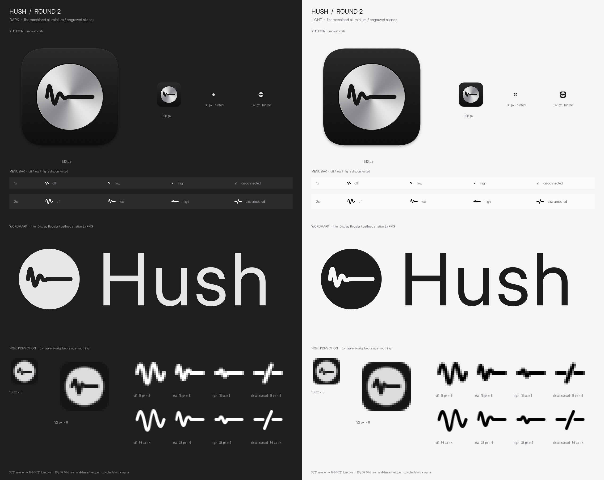

# Hush

A menu-bar controller for Bose NC700 headphones on macOS, without the Bose app:
noise cancelling, EQ, self voice, conversation mode, device switching, battery, and
every headphone setting, plus automations the Bose app doesn't have.

Built with React Native for macOS 0.83, react-native-skia 3 and Reanimated 4.



> Hush is an independent project. It is not affiliated with, endorsed by or supported by
> Bose Corporation. "Bose" and "NC 700" are trademarks of Bose Corporation. The protocol
> notes below come from observing the headphones' own responses; use at your own risk.
> Hush never sends firmware-update, factory-reset or authentication commands.

## Requirements

- macOS 14+ (the command bar needs macOS 26 with Apple Intelligence on)
- Bose Noise Cancelling Headphones 700, paired and connected to the Mac
  (tested on firmware 2.0.4; other BMAP headsets may partly work)
- Xcode 16+, Node 20+, CocoaPods to build

## How it talks to the headphones

The NC700 exposes Bose's BMAP control protocol on a classic Bluetooth serial
channel (RFCOMM, SDP service name "SPP Dev"). `macos/HushBluetooth/HushBluetooth.swift`
finds a connected headset with that service, opens the channel and passes raw
bytes to JS. Everything protocol-level lives in `src/bmap.ts`.

Frame: `[block, function, operator, length, ...payload]`
Operators: 1 GET, 2 SETGET, 3 STATUS (reply), 4 ERROR, 5 START, 6 RESULT, 7 PROCESSING.

| Feature | Read | Write |
|---|---|---|
| Firmware | `00 05 01 00` → ASCII | — |
| Noise cancelling | `01 05 01 00` → `[steps, raw, enabled]` | `01 05 02 02 [10-level, enabled]` (raw is inverted) |
| EQ | `01 07 01 00` → `[min, max, value, band] × 3` | `01 07 02 02 [value, band]` |
| Self voice | `01 0b 01 00` → `[persist, mode, mask]` | `01 0b 02 02 [1, mode]` (0 off, 1 high, 2 med, 3 low) |
| Battery | `02 02 01 00` → `[percent, …]` | — |
| Paired devices | `04 04 01 00` → `[?, mac × n]` | — |
| Device info | `04 05 01 06 [mac]` → `[mac, status, ?, type, name]` | — |
| Connect device | — | `04 01 05 07 [00, mac]` |
| Disconnect device | — | `04 02 05 06 [mac]` |
| Forget device | — | `04 03 05 06 [mac]` |
| Pairing mode | `04 08 01 00` → `[active, …]` | enter `04 08 05 01 01`, leave `04 08 05 01 00` (may drop a connection) |
| Name | `01 02 01 00` → `[00, utf8…]` | `01 02 02 n [utf8…]` |
| Voice prompts | `01 03 01 00` → `[(on<<5)\|lang, mask×4]` | `01 03 02 01 [(on<<5)\|lang]` |
| Auto-off | `01 04 01 00` → `[minutes]` (0 = never) | `01 04 02 01 [minutes]` |
| Shortcut button | `01 09 01 00` → `[80, 05, action, …]` | `01 09 02 03 [80, 05, action]` (3 battery, 16 Spotify Tap) |
| Multipoint | `01 0a 01 00` → bit0 enabled | `01 0a 02 01 [0/1]` |
| Conversation mode | `01 0d 01 00` → `[0/1]` | `01 0d 02 01 [0/1]` (also what holding the ANC button does) |
| ANC button presets | `01 0f 01 00` → `[index, raw×3]` | `01 0f 02 04 [index, raw×3]` (applies preset[index] live) |

Verified on NC700 firmware 2.0.4. Some SETGETs never reply, so writes are followed by
a GET. SET (op 00) returns error 05; SETGET is unauthenticated.

The NC700 keeps up to 8 paired devices but only 2 live connections; the device
switcher drops the other non-host connection before connecting a new one.

## Build and run

```sh
npm install
cd macos && pod install && cd ..
npx react-native start            # Metro
open macos/Hush.xcworkspace       # run the Hush-macOS scheme
```

Release build (JS bundled into the app):

```sh
cd macos
xcodebuild -workspace Hush.xcworkspace -scheme Hush-macOS -configuration Release -derivedDataPath build
cp -R build/Build/Products/Release/Hush.app /Applications/
```

## Features beyond the Bose app

- **Call mode**: while any app uses the microphone (CoreAudio "device is running"), noise
  cancelling goes to 10 and self voice to low; previous settings come back afterwards.
- **Bring headphones here on unlock**: unlocking this Mac connects the headset to it.
- **Meeting prep**: five minutes before a calendar meeting (attendees or a video link) Hush
  pulls the headset to this Mac and warns if the battery won't last (EventKit, opt-in).
- **Learned per-app rules**: after you set the same noise cancelling level in an app a few
  times, Hush offers to make it automatic for that app. **Device prediction** suggests the
  device you usually switch to at this time of day. Both are local counting (`src/learn.ts`).
- **Battery time remaining** from your measured drain rate (`src/battery.ts`), plus a
  low-battery notification.
- **Command bar** (macOS 26 + Apple Intelligence): plain English such as "quieter, let me
  hear the door" is turned into allow-listed Hush commands by Apple's on-device model.
  Hidden when the model is unavailable.
- **⌥⌘N** cycles noise cancelling 0 → 5 → 10 from anywhere.
- Knobs: drag, scroll/trackpad, arrow keys, double-click to centre EQ; detents with
  trackpad haptics.

## CLI and URL scheme

`bin/hush` drives the running app through `hush://` URLs and reads its state file
(`~/Library/Application Support/Hush/state.json`).

```sh
hush                      # status
hush anc 10 | up | down | cycle
hush eq bass 4            # or: hush eq flat
hush selfvoice low
hush switch ipad
hush callmode on
```

URLs: `hush://anc/10`, `hush://eq/bass/-3`, `hush://eq/flat`, `hush://selfvoice/off`,
`hush://switch/<name>`, `hush://callmode/on`, `hush://conversation/on`. Usable from
Raycast, Alfred, Stream Deck or scripts.

## MCP server

`mcp/` is a small MCP server (stdio) that lets AI agents read and control the headphones. It shells out to `bin/hush`, so the Hush app does the Bluetooth work. Tools: `get_headphones_status`, `set_noise_cancelling`, `set_eq`, `set_self_voice`, `switch_headphones`, `set_call_mode`. Each write waits ~1.5s, then reads the status again and reports whether the change took.

```sh
cd mcp && npm install
claude mcp add hush -- node /path/to/hush/mcp/server.js
```

Or in a JSON MCP config (Claude Desktop, `.mcp.json`):

```json
{
  "mcpServers": {
    "hush": {
      "command": "node",
      "args": ["/path/to/hush/mcp/server.js"]
    }
  }
}
```

Env: `HUSH_CLI` overrides the CLI path (default `../bin/hush` relative to the server), `HUSH_SETTLE_MS` overrides the wait before confirming (default 1500). `npm test` in `mcp/` runs a smoke test against a fake CLI. It never touches the real headphones.

## Shortcuts & Focus

Hush exposes App Intents (`macos/Hush-macOS/Intents/`), so it shows up in the
Shortcuts app, Spotlight and Siri:

- **Set Noise Cancelling** (0–10), **Set EQ** (band + value), **Set Self Voice**,
  **Switch Headphones** (picks from the paired devices), **Get Headphone Battery**
  (returns the percentage, says time remaining).
- Siri phrases include the app name, e.g. "Switch Hush to iPhone", "What's my Hush battery".
- **Focus filter**: System Settings → Focus → (a Focus) → Focus filters → Hush profile.
  Pick a noise cancelling level, how much you hear yourself on calls and optionally a flat EQ. When the
  Focus turns on Hush snapshots the current settings (UserDefaults `hush.focusSnapshot`)
  and applies the profile; when it turns off the snapshot is restored.
  The build must be signed with a development team (Xcode → Signing & Capabilities): with
  ad-hoc signing System Settings shows an empty filter form and can't save it.

Intents run inside the menu-bar app and go through the same `hush://` command path as
the URL scheme and CLI. If Hush isn't running macOS launches it; intents wait up to
10 s for the headset to connect before failing.

## Layout

- `App.tsx`: popover UI (Sound / Devices / Settings tabs)
- `src/bmap.ts`: protocol encode/decode
- `src/useHeadset.ts`: connection, polling, state and every automation above
- `src/commands.ts`: `hush://` command language (URL scheme, CLI, command bar, intents)
- `src/learn.ts`, `src/battery.ts`, `src/useMeetingPrep.ts`, `src/ai.ts`: features above, with tests in `__tests__/`
- `src/NoiseField.tsx`: Skia shader background that calms as noise cancelling rises
- `src/Knob.tsx`, `src/Ring.tsx`, `src/Segmented.tsx`, `src/Toggle.tsx`: controls
- `macos/HushBluetooth/`: native modules: `HushBluetooth` (RFCOMM bridge, pull to this Mac),
  `HushSystem` (login item, hotkey, notifications, menu-bar state, mic/unlock/front-app events,
  wheel events, haptics, prefs, state file), `HushCalendar` (EventKit), `HushAI` (Foundation Models)
- `macos/Hush-macOS/Intents/`: App Intents and the Focus filter
- `mcp/`: MCP server

## Development

```sh
npm test            # protocol, battery, learning, meetings and command-bar tests
npm run typecheck
```

`assets/brand/tools/build.py` regenerates the icon, menu-bar glyphs and wordmark.

## License

MIT. See [LICENSE](LICENSE).
